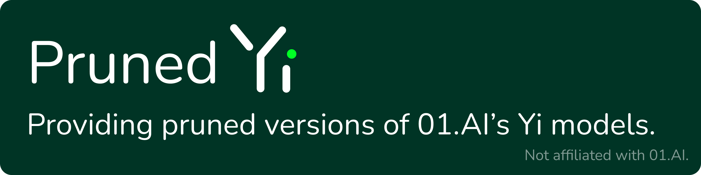

# Pruned Yi

Creating <6B SLM models based on 01.AI's amazing Yi models!

Models are pruned using the awesome [ShortGPT](https://github.com/sramshetty/ShortGPT) codebase.

**Not affiliated with 01.AI in any way.**

## Steps

1. The models are pruned from Yi 1.5 6B using [ShortGPT](https://github.com/sramshetty/ShortGPT).
2. The models are healed (further pretrained) on data. See the Data section below for more details.

## Data

Once the models are pruned they must be "healed" on data to generate coherent text. Since Yi is a bilingual (English + Chinese) model, the data should be bilingual to maintain the model's capabilities. Pruned Yi primarily focuses on English, so the ratio of English to Chinese text is about 2:1. The following datasets may be used:

**Base models:**

* [Cosmopedia](https://huggingface.co/datasets/HuggingFaceTB/cosmopedia)
* Select, cleaned articles from Chinese Wikipedia converted to Simplified Chinese

**Conversational models:**

For conversational models, a two-stage training method should be employed. First, the conversational models should be trained on the same data as the base models. Then, the models can be trained on the following datasets:

* [SlimOrca](https://huggingface.co/datasets/Open-Orca/SlimOrca)

## Models

Models are still a work-in-progress. Models are listed in this section.

### Trained Models

| Name | Link | License |
| --- | --- | --- |
| Pruned Yi 3B | _Coming soon_ | Apache 2.0 |
| Pruned Yi 3B Chat | _Coming soon_ | Apache 2.0 |

### Untrained Models

| Name | Link | License |
| --- | --- | --- |
| Pruned Yi 3B Untrained | [🤗 Model](https://huggingface.co/pruned-yi/pruned-yi-3b-untrained) | Apache 2.0 |
| Pruned Yi 3B Chat Untrained | _Coming soon_ | Apache 2.0 |

## Code

The code for healing a pruned model (powered by Unsloth) is provided in this repository, under the `healing` directory. Please note that because the dataset for healing is currently not public, you will need to curate your own. Replace `pruned-yi/healing-data` in the code with the name of your dataset.

## Limitations

The field of LLMs is still an emergent field and the models may generate offensive or inaccurate content. You are responsible for your usage of the models.

As the models are trained on widely available public texts, they may exhibit biases or generate offensive or inaccurate content. Proper precautions should be taken when using the models and users should be made aware of these risks and limitations.

## License

The code in this repository is licensed under the Apache 2.0 license. Unless otherwise noted, all documentation is licensed under the CC-BY-SA license. Unless otherwise noted, all models are licensed under the Apache 2.0 license. The Apache 2.0 license is a permissive license that allows unlimited free commercial usage, with a few restrictions. Please refer to the license text for details.

## Disclaimer

**IMPORTANT: The author(s) of Pruned Yi is not affiliated with the authors of the Yi models or 01.AI in any way.**

THE MODEL IS PROVIDED "AS IS" AND THE AUTHOR DISCLAIMS ALL WARRANTIES WITH REGARD TO THIS MODEL INCLUDING ALL IMPLIED WARRANTIES OF MERCHANTABILITY AND FITNESS. IN NO EVENT SHALL THE AUTHOR BE LIABLE FOR ANY SPECIAL, DIRECT, INDIRECT, OR CONSEQUENTIAL DAMAGES OR ANY DAMAGES WHATSOEVER RESULTING FROM LOSS OF USE, DATA OR PROFITS, WHETHER IN AN ACTION OF CONTRACT, NEGLIGENCE OR OTHER TORTIOUS ACTION, ARISING OUT OF OR IN CONNECTION WITH THE USE OR PERFORMANCE OF THIS MODEL.
